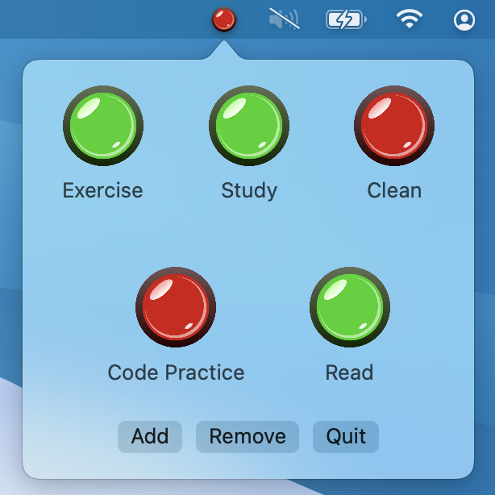
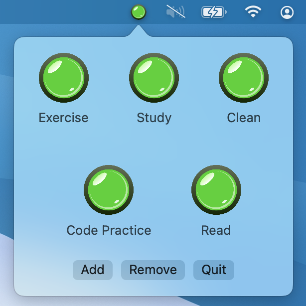

# Dopamine Switch
The Dopamine Switch is a daily checklist that lives in the macOS menu bar. Track daily tasks by lighting up satisfying green buttons; when you're done the icon lights up, providing satisfaction for the remainder of the day when you look at your menu bar. The buttons reset when the date changes. The button states persist between runs, as long as there has been no date change since the most recent run. Inspired by Mike Boyd's [Dopamine Box](https://www.youtube.com/watch?v=JJeQIXBdVuk).

